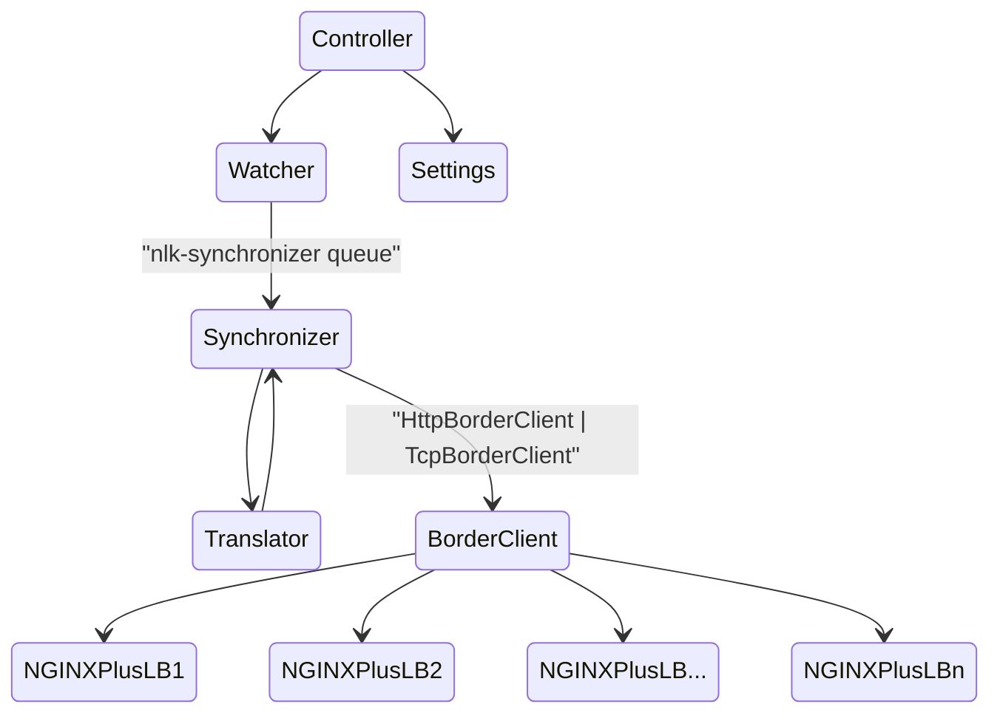

# Overview

The nginx-loadbalancer-kubernetes runs in a Kubernetes cluster and responds to changes in specified services by issuing requests to the designated NGINX Plus hosts to update the appropriate upstreams.

## Basic Architecture

The controller is deployed in a Kubernetes cluster. Upon startup, it registers interest in changes to services with the appropriate annotation.
The Watcher listens for events raised by the cluster and then adds these events to the Synchronizer's queue. The Synchronizer makes use of the Translator to transform the events into specific updates that will be sent to the NGINX Plus hosts.
Lastly, the Synchronizer calls the [NGINX+ Configuration API](https://docs.nginx.com/nginx/admin-guide/load-balancer/dynamic-configuration-api/) using the [NGINX Plus Go client](https://github.com/nginxinc/nginx-plus-go-client) to update the target NGINX Plus host(s).



### Settings

The Settings module is responsible for loading the configuration settings when the controller starts. Any changes made to the settings through helm at runtime will cause nginx-loadbalancer-kubernetes to be restarted.

### Watcher

The Watcher is responsible for monitoring changes to Service resources that are annotated by the user.
It registers methods that handle each event type. An event is created for a particular service and is added to the "nlk-synchronizer" queue.

### Translator

The Translator is responsible for converting a `core.Event` event into an `nginxClient.UpstreamServer` event.

The Translator assembles a list of IP addresses for the Kubernetes service, routing traffic to the NodePorts, ClusterIPs or external load balancer, depending on the Kubernetes service type. If the service is of type NodePort, the Translator excludes the master node IP from the list of the addresses. (NOTE: This should be configurable.)

The Translator uses the port name to determine the protocol and the name of the user's upstream. For example, if the user has named their service port "http-tea", the translator will create an update event for the HTTP upstream named "tea".

**NOTE: It is important that the Port names match the name of the defined NGINX Plus Upstreams.**

In the following example the service uses the `nginx.com/nginxaas: nginxaas` annotation so that NLK knows to monitor the service. NGINX Plus Upstreams are named "ingress" and "ingress-tls". These match the upstream names specified in the NGINX configuration on the NGINX Plus host.

```yaml
apiVersion: v1
kind: Service
metadata:
  annotations:
    nginx.com/nginxaas: nginxaas
  name: nginx-ingress
  namespace: nginx-ingress
spec:
  type: NodePort 
  ports:
  - port: 80
    targetPort: 80
    protocol: TCP
    name: http-ingress
  - port: 443
    targetPort: 443
    protocol: TCP
    name: http-ingress-tls
  selector:
    app: nginx-ingress
```

### Synchronizer

The Synchronizer is responsible for fanning-out the given list of `core.ServerUpdateEvent` events, one for each configured NGINX Plus host.
The NGINX Plus hosts are configured through the helm chart `nlk.config.nginxHosts` value. Use a string for a single host and a sequence for multiple hosts. See the comments in `charts/nlk/values.yaml` for details.

The Synchronizer uses the [NGINX Plus Go client](https://github.com/nginxinc/nginx-plus-go-client) to communicate with each NGINX Plus host.

#### Retry Mechanism

The Synchronizer uses a retry mechanism to handle failures when updating the NGINX Plus hosts.
The retry mechanism is implemented in the workqueue using the `workqueue.NewItemExponentialFailureRateLimiter`,
having defaults set to a base of 2 seconds, and a maximum of 60 seconds.

## Authors

- Steve Wagner - Solutions Architect - Community and Alliances @ F5, Inc.
- Chris Akker - Solutions Architect - Community and Alliances @ F5, Inc.
